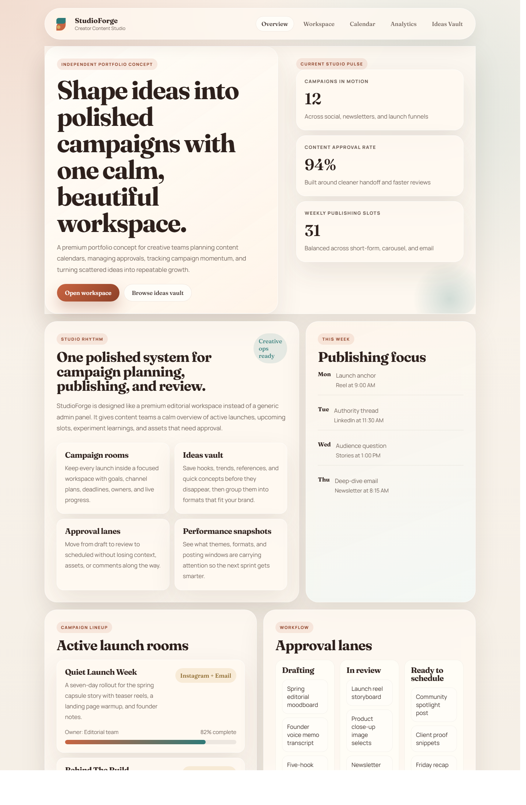
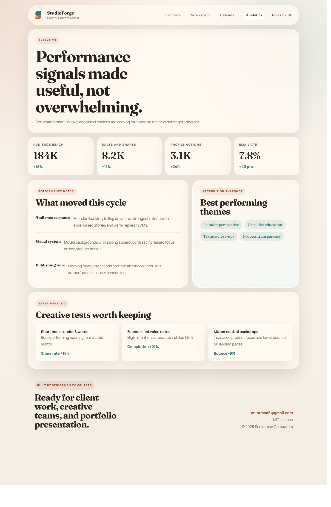

# StudioForge

StudioForge is a professional content operations suite built by `Seniorman Computers`.

It provides a modern interface for planning campaigns, organizing publishing schedules, managing approvals, storing content ideas, and reviewing performance snapshots.

## Overview

- A refined product landing page with an editorial interface
- A workspace dashboard for active campaigns and approval flow
- A weekly content calendar view
- An analytics page with performance notes and experiment tracking
- An ideas vault for hooks, prompts, and reusable brand pillars
- Shared branding, footer, license, and contact details for `Seniorman Computers`

## Tech

- PHP
- HTML
- CSS
- Small vanilla JavaScript for the mobile navigation toggle

## Screenshots

### Overview



### Workspace


### Analytics



## Folder structure

- `index.php`
- `workspace.php`
- `calendar.php`
- `analytics.php`
- `ideas.php`
- `includes/`
- `assets/`

## Local preview

If you are using XAMPP or plain PHP, open the project folder and serve it like a normal PHP site.

Example with PHP:

```bash
php -S localhost:8080
```

Then open:

```text
http://localhost:8080/index.php
```

## Branding

- Company: `Seniorman Computers`
- Contact: `cniorman6@gmail.com`
- Phone: `08164616531`
- License: `MIT`

## License

This project is released under the MIT License by `Seniorman Computers`. See [LICENSE](LICENSE).
